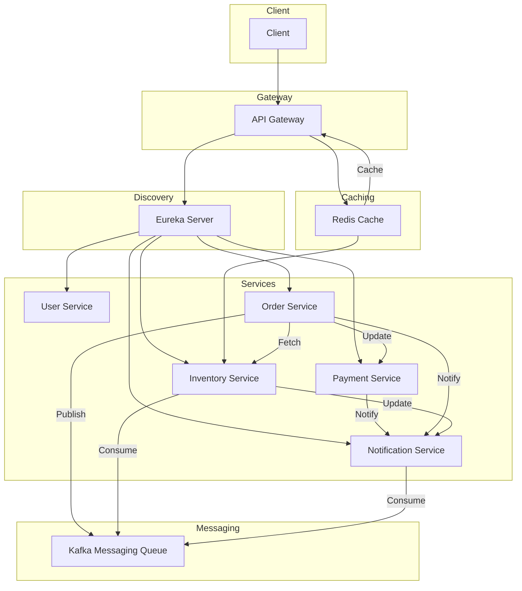

# shopping site

# local environment
- Eureka Server http://localhost:8761/
- Swagger UI - http://localhost:8888/swagger-ui/index.html
- Order API - http://localhost:8888/order/api/v1/order/place?quantity=6

### Eureka Server

### Swagger UI

# Important links
- https://kafka.apache.org/quickstart
- https://zipkin.io/pages/quickstart.html

# Architecture Flow:
	
	Client Requests → API Gateway → Eureka Server → Microservices

                                         
    Here is a simple flow chart:

# Explanation of the Flow:
- Client (C) sends requests to the API Gateway (API), which serves as the entry point.
- API Gateway communicates with the Eureka Server (E) for service discovery to route requests to the appropriate services.
- Redis Cache (Redis) is used to cache frequently accessed data, such as product information.
Services interact with each other:
- Order Service interacts with Inventory Service to fetch product availability.
- Payment Service handles payment processing for an order.
- Notification Service sends notifications after certain actions (e.g., order placement, payment confirmation).
- Kafka is used as a messaging queue to facilitate communication between services.
- Redis Cache provides a caching layer to improve performance.
