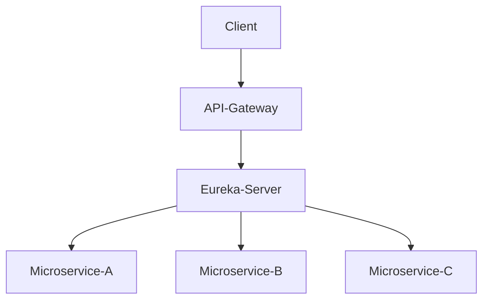

# shopping site

# Architecture Flow:
	
	Client Requests → API Gateway → Eureka Server → Microservices

                                         
    Here is a simple flow chart:

```mermaid
graph TD;
	Client  --> API-Gateway;
 	API-Gateway --> Eureka-Server;
    	Eureka-Server--> Microservice-A;
    	Eureka-Server--> Microservice-B;
    	Eureka-Server--> Microservice-C;
```
